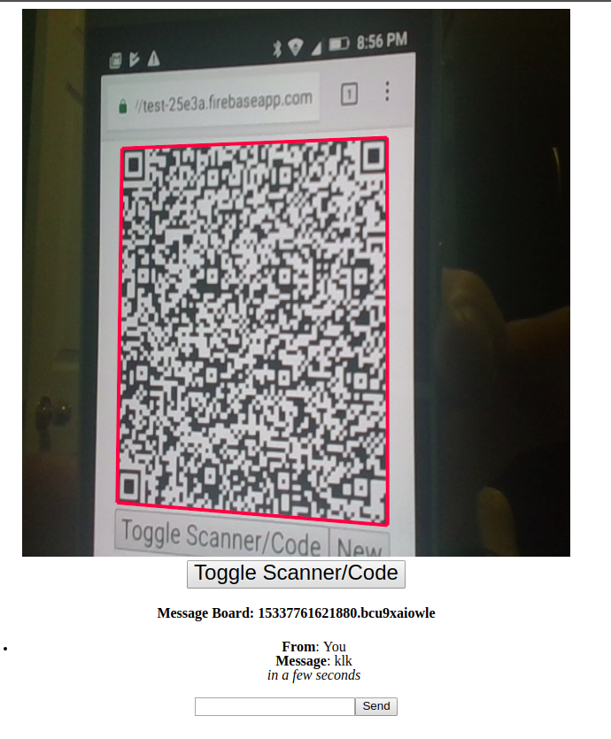

# Message Chat without a central server
A simple proof of concept for web-rtc annon chat messaging without the need for a central server.
Calling is done via QR Code scanning, so you never need to host any third-party service for the communication.

# Technologies
- Typescript 
- React
- WebRTC
- Parcel
- Firebase (for hosting only, needed free SSL for hosting)
